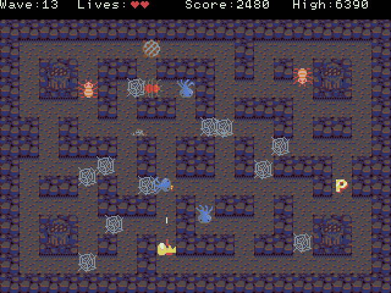

# Oxid
Oxid is an arcade-style game where you fight waves of monsters in a fixed-screen maze. This is more or less a clone of [Verminian Trap](http://locomalito.com/verminian_trap.php) (2013, Locomalito). Verminian Trap was originally inspired by [Wizard of Wor](https://en.wikipedia.org/wiki/Wizard_of_Wor) (1980, Midway). Oxid is currently not nearly as fun as Verminian Trap, see TODO.md for planned features.

Oxid is written in the [Zig](https://ziglang.org) programming language.

## How to play
* Install [SDL2](https://www.libsdl.org/), SDL2_mixer and [libepoxy](https://github.com/anholt/libepoxy)
* Install [Zig](https://ziglang.org/download/) (get it from master, version 0.2.0 is too old)
* Depending on your version of Git, you may have to explicitly update the submodules: `git submodule init` followed by `git submodule update`
* `zig build play`

Game controls:
* arrow keys: move
* space: shoot
* tab: pause
* esc: quit
* backspace: reset
* m: toggle sound muting

Debug/cheat controls:
* backquote: fast forward
* return: skip to next wave
* F2: toggle rendering of move boxes
* F3: toggle invulnerability
* F4: toggle profiling spam
* F5: cycle through preserved graphics glitches

## Screenshot

## Code
Oxid uses a minimalistic Entity Component System. Here are the main gameplay-related files:
* [src/oxid/components.zig](src/oxid/components.zig) - struct definitions of each component type
* [src/oxid/frame.zig](src/oxid/frame.zig) - calls into systems
* [src/oxid/game.zig](src/oxid/game.zig) - component type registration
* [src/oxid/prototypes.zig](src/oxid/prototypes.zig) - entity spawning functions
* [src/oxid/systems/*.zig](src/oxid/systems/) - all of the systems (i.e. think functions)

The ECS framework itself is located at `src/gbe*.zig`. It is small but quite rough and somewhat opaque as it involves a fair bit of metaprogramming.

Actually using the ECS requires practically no excess boilerplate.
* To add a component type, add a struct to `components.zig` and register it in `game.zig`.
* To add an entity prototype, add a function to `prototypes.zig`.
* To add a system, add a file to `systems/` and import/call it in `frame.zig`.

Adding new graphics, sound effects, or input bindings is not as polished but still relatively easy. Documentation to come later.

Please do not look inside `physics.zig`.

## Notes
Low-level graphics code was lifted from andrewrk's [Tetris](https://github.com/andrewrk/tetris) demo for Zig.

Sound effects from https://opengameart.org/content/512-sound-effects-8-bit-style

Uses [Dawnbringer's 16-colour palette](http://pixeljoint.com/forum/forum_posts.asp?TID=12795).

Uses my [zigutils](https://gitlab.com/dbandstra/zigutils) and [zig-comptime-pcx](https://gitlab.com/dbandstra/zig-comptime-pcx) libraries.
